# Hands-on exercise for week 1 unit 6:<br/>Creating a list report

## Previous exercise
[Hands-On exercise for week 1 unit 5: Creating an OData service with ABAP RESTful Application Programming Model](unit5.md)

## Video on openSAP.com platform
[Creating a list report](https://open.sap.com/courses/fiori-ea1/items/2yQj1EbqHia8XDWTnNshA3)

## Introduction
In the CDS files of your RAP based service you can add annotations to refine the user interface. These CDS annotations will be translated into OData annotations used by SAP Fiori elements to generate the UIs. UI annotations are stored within metadata extension files to separate them from the CDS view structure for better reading.

In this unit you will add annotations to refine a list report (the 'travel list'). You  will use the ABAP Development Tools in Eclipse which you installed in the [hands-on exercises for week 1 unit 4 ](unit4.md). 

You will learn how to
- Add columns to the table
- Add selection fields to the filter bar
- Add list report header information  
- Define a value help as a drop down list
- Define criticality ratings
>Whenever your unique suffix for creating objects is needed, the object names within this tutorial are named with suffix "######". For the screenshots the suffix "000100" was used.

**Prerequisite: You have performed all previous exercises of this course.**


## Step 1. Start the app preview
1. Start the service preview

    When the service is published, its entities are shown within a tree-view on the right part of the service binding.

    With that the service is actively running and can be used for creating SAP Fiori elements applications.

    To immediately see the service running in an application you can start the preview mode within the ABAP Development tools. Simply select the main entity **Travel** in the tree-view and press the **Preview...** button on the right side of the service binding.

    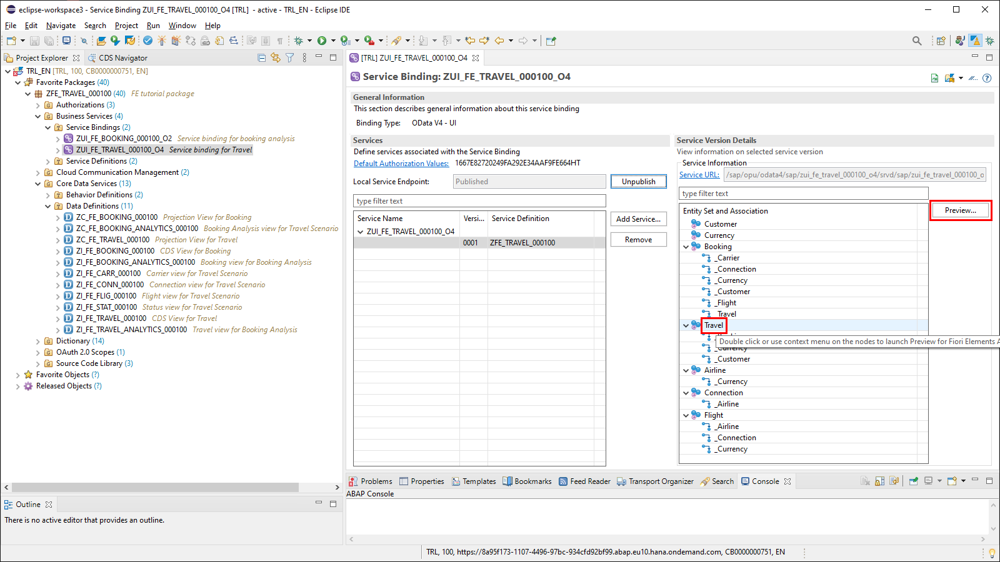


2. Logon to the service preview

    A separate browser window opens and you need to logon with your cloud trial account. Press the **Log On** button after you have entered your account email and password.

    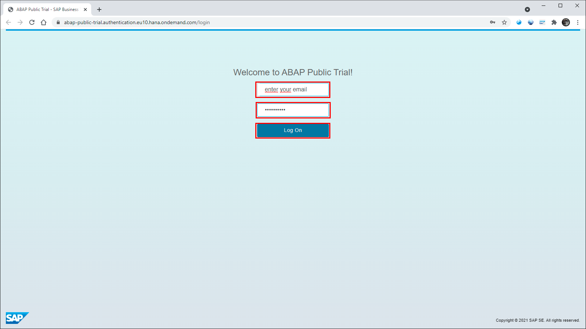

    After logging in, a generated list report object page application will be  shown in preview mode. Since there are no line item annotations available, no columns are shown in the list report table.

    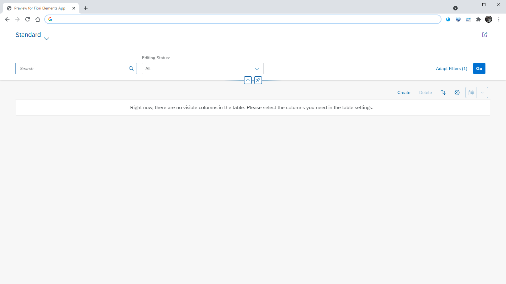


## Step 2. Create a metadata extension file for the Travel entity
Annotations controlling the UI can be stored in metadata extension files. In this section such a file will be created for the Travel entity and a first annotation will be added.


1. Right clicking the `ZC_FE_TRAVEL_######` projection view for the Travel entity opens a context menu. Choose option **New Metadata Extension**.

    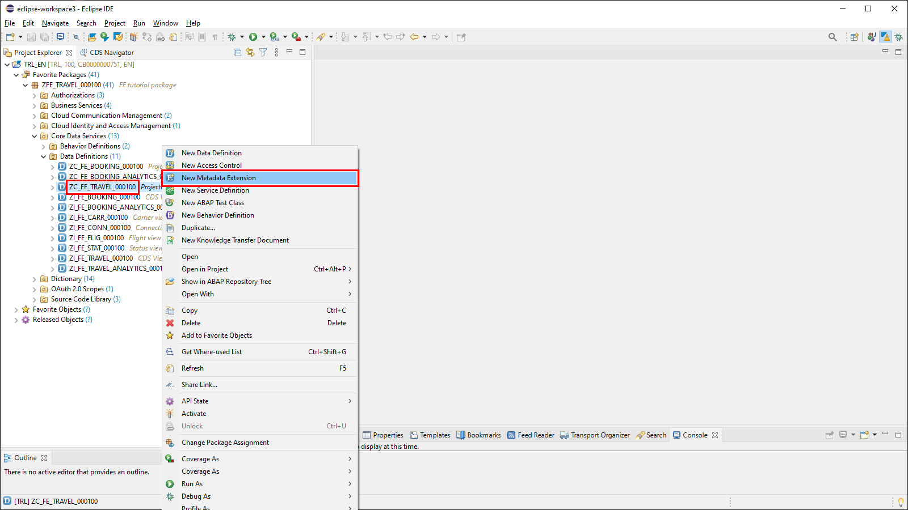

    Enter the name of your metadata extension file. Choose the same name as your projection view file name **`ZC_FE_TRAVEL_######`** and enter a description as well. Click **Next**.

    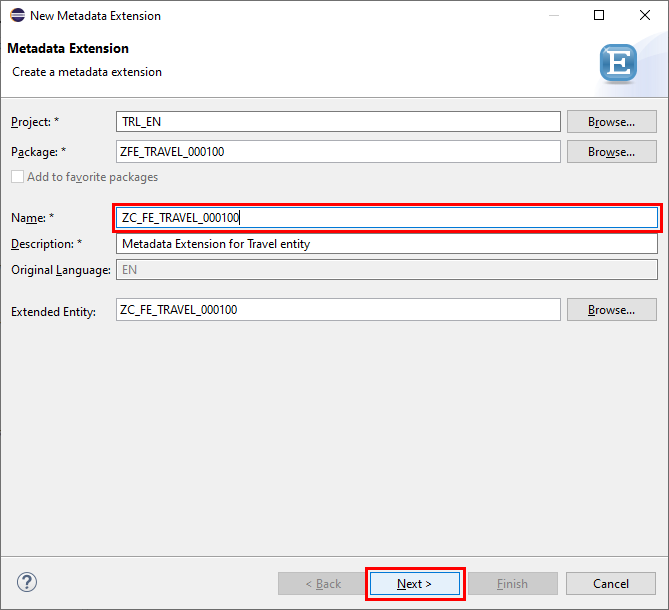

    A transport request is already assigned to the metadata extension file. Press  **Finish** to confirm the creation of the file.

    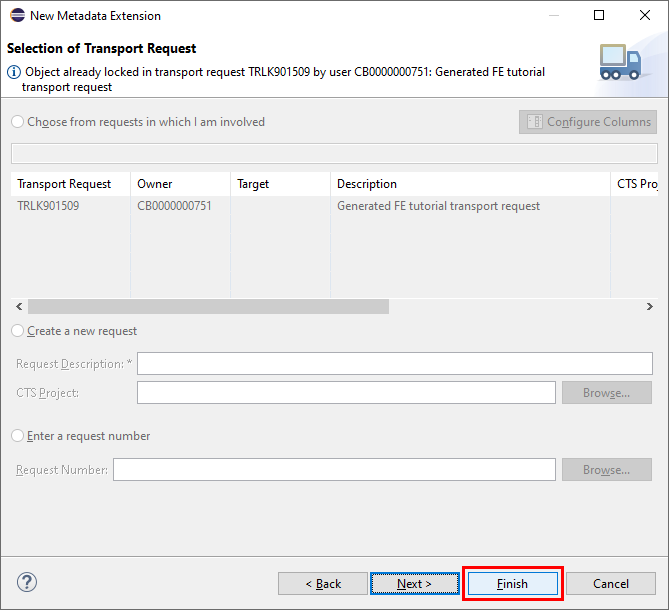


2. Now open the new metadata extension file `ZC_FE_TRAVEL_######` within the **Metadata Extensions** folder. To show a first column within the list report table, add the content shown in the coding example below. 

    >You can use code completion by pressing **`CTRL+SPACE`** at the related coding positions, e.g. when adding the `@UI.lineItem` annotation, just type **`@UI`** and then press **`CTRL+SPACE`** to choose the entry from the list of proposals.

    ```CDS
    @Metadata.layer: #CORE
    annotate view ZC_FE_TRAVEL_###### with
    {
        @UI.lineItem: [{ position: 10 }]
        TravelID;
    }
    ```

    Note that the metadata layer of our app is set to **`#CORE`**. Metadata extensions support a layering concept where **`#CORE`** has the lowest and **`#CUSTOMER`** has the highest priority. Code completion shows you the full list of available values.

    To finish this step, press **Save** and **Activate** to take over the changes in your metadata extensions file.

    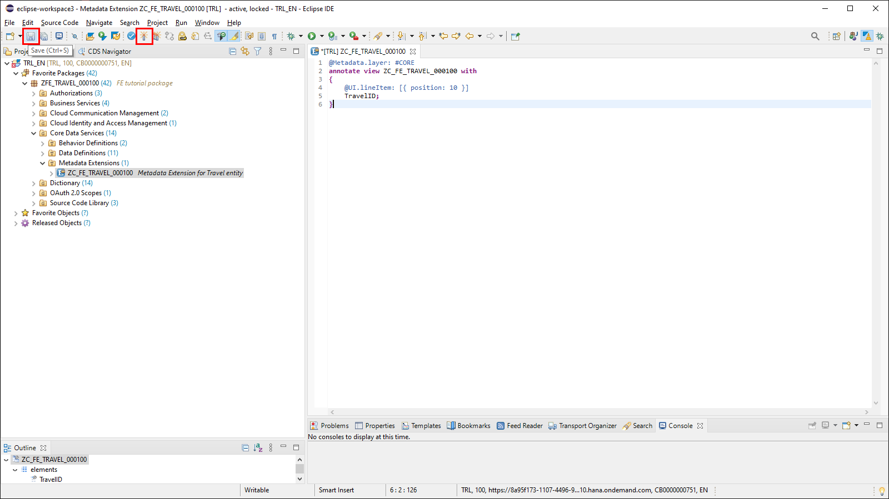

    Check your changes by refreshing the preview of your application and press the **Go** button to load the data.

    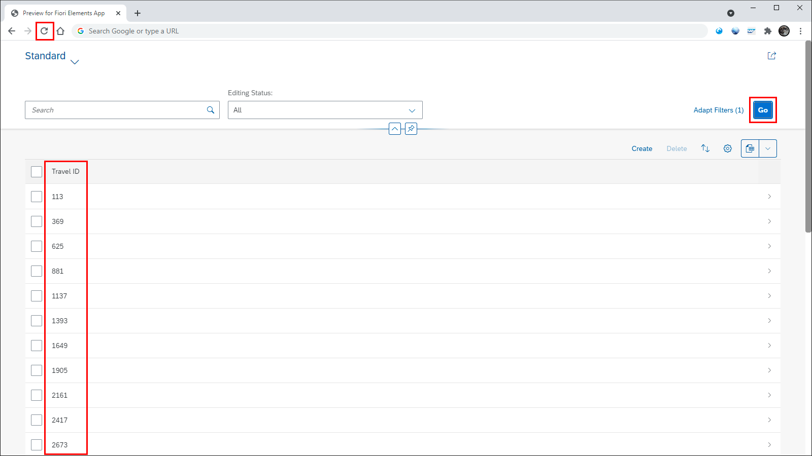

    You will now see the column **Travel ID** made visible on the list report table by the `@UI.lineItem` annotation added to the metadata extensions file. The data shown in the column is loaded from the database with the request triggered by the **Go** button.


## Step 3. Add table columns and filter bar selection fields
To see some more data on the list report you are now adding more columns to the table and to simplify the selection of data you will add filter fields to the filter bar.

1. If no longer open, please open the metadata extension file `ZC_FE_TRAVEL_######` located in folder `Core Data Services` > `Metadata Extensions`.

    Now add the fields with the corresponding `lineItem` annotations to the metadata extension file as shown in the code fragment below. The property `position` controls the order of the columns within the list report table.

    ```CDS
    @UI.lineItem: [{ position: 20 }]
    AgencyID;

    @UI.lineItem: [{ position: 30 }]
    CustomerID;

    @UI.lineItem: [{ position: 40 }]
    BeginDate;

    @UI.lineItem: [{ position: 50 }]
    EndDate;

    @UI.lineItem: [{ position: 60 }]
    BookingFee;

    @UI.lineItem: [{ position: 70 }]
    TotalPrice;

    @UI.lineItem: [{ position: 80 }]
    OverallStatus;

    @UI.lineItem: [{ position: 90 }]
    LocalLastChangedAt;
    ```

    As a result, after saving and activating the metadata extension file and then refreshing the preview of your application, you will see the additional columns shown in the list report table.

    >Note: The default table type of a list report is the responsive table. You can show or hide columns of list report and object page tables depending on the screen width using the `Importance: #High/#Medium/#Low` property in the lineItem annotation. If the screen size is narrowed down too much, the columns annotated with High and Medium start to pop in, while the ones annotated with Low are hidden. As soon as the first column is hidden, a button `Show Details` appears in the table toolbar.

    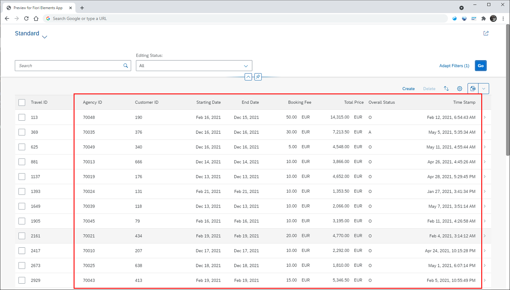


2. To assign specific fields to the filter bar you will use the `selectionField` annotation. Add this annotation to the three existing fields `AgencyID`, `CustomerID` and `OverallStatus` as shown in the coding example below.

    ```CDS
    @UI.lineItem: [{ position: 20 }]
    @UI.selectionField: [{ position: 10 }]
    AgencyID;

    @UI.lineItem: [{ position: 30 }]
    @UI.selectionField: [{ position: 20 }]
    CustomerID;
    ```
    ```CDS
    @UI.lineItem: [{ position: 80 }]
    @UI.selectionField: [{ position: 30 }]
    OverallStatus;
    ```

    Again save and activate the file and refresh the application to see the changes on the UI.

    You can now filter the data loaded into the list report by specifying values for these additional selection fields.

    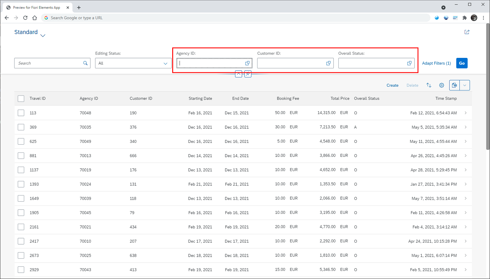


## Step 4. Add header information and default sorting
Now the list report table shall be sorted by the last updated travel records and also the number of records available in the database shall be visible. 

1. To achieve this, add header information to the metadata extension file right above the view annotation.
Note that we didn't cover the presentationVariant property in the corresponding openSAP video for timing reasons.

   >Reminder: You can use code completion by pressing **`CTRL+SPACE`** at the related coding positions, e.g. when adding the `@UI.headerInfo` annotation, just type **`@UI`** and then press **`CTRL+SPACE`** to choose the entry from the list of proposals.

   ```CDS
   @Metadata.layer: #CORE
   
   @UI: {
       headerInfo: {
           typeName: 'Travel',
           typeNamePlural: 'Travels'
       },
       presentationVariant: [{
           sortOrder: [{
               by: 'LocalLastChangedAt',
               direction: #DESC
           }],
           visualizations: [{
               type: #AS_LINEITEM
           }]
       }]
   }
   
   annotate view ZC_FE_TRAVEL_###### with
   {
   ...
   ```

   The `@UI.headerInfo` annotation contains information about the naming of the main entity in singular and plural format and it shows the number of records available in the database in the table title. The  table title is determined by the `typeNamePlural` property.

   The `@UI.presentationVariant` annotation controls the sorting of the table by field `LocalLastChangedAt` via `sortOrder` property. The `visualizations` property determines that the sorting is applied to the list report table.


2. Save and activate the metadata extension file and refresh the application preview to see the result on the UI.

   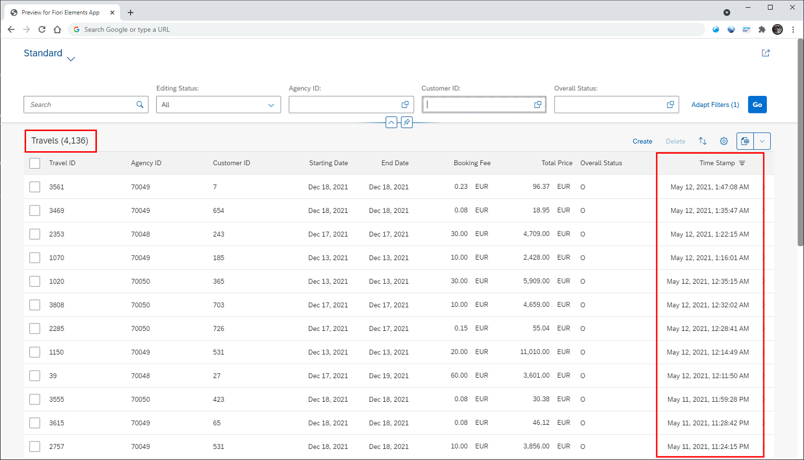


## Step 5. Refine columns having IDs
Instead of showing IDs for the fields Travel ID, Agency ID and Customer ID one would preferably show descriptions or names. Additionally some labels of specific fields will be changed globally to make the new label accessible wherever the fields will be used on the list report or object page.

1. You will achieve this by using specific annotations which are  implemented within the projection view `ZC_FE_TRAVEL_######`. For this, open the projection view located in folder **Core Data Services** > **Data Definitions** which contains the root view definitions for the Travel entity.

    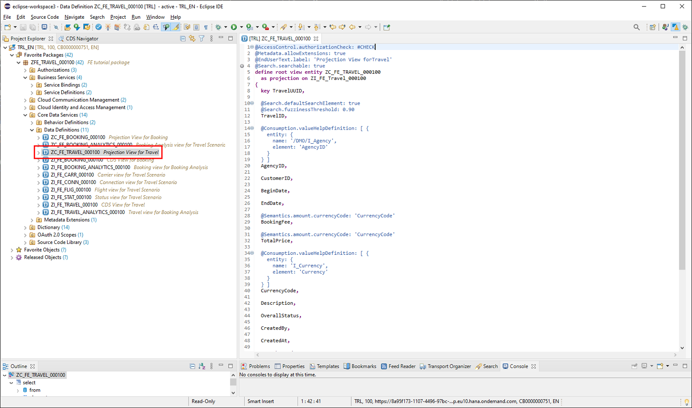


2. Add the `@EndUserText` and `@ObjectModel` annotations to the fields as shown in the coding fragments below.

    Annotation `@EndUserText.label` defines the column label for the related fields. `@ObjectModel.text.element` controls the source of the content shown for the related field. For field `TravelID` this will be the `Description` field from this view. `AgencyID` and `CustomerID` will get their content from the related field through the corresponding association.

    ```CDS
    @EndUserText.label: 'Travel'
    @ObjectModel.text.element:  [ 'Description' ]
    TravelID,
    ```
    ```CDS
    @EndUserText.label: 'Agency'
    @ObjectModel.text.element: ['AgencyName']
    AgencyID,
    _Agency.Name as AgencyName,
    ```
    ```CDS
    @EndUserText.label: 'Customer'
    @ObjectModel.text.element: ['LastName']
    CustomerID,
    _Customer.LastName as LastName,
    ```
    ```CDS
    @EndUserText.label: 'Status'
    OverallStatus,
    ```
    ```CDS
    @EndUserText.label: 'Last Changed At'
    LocalLastChangedAt,
    ```
    The semantic key for the view will be `TravelID`. The content of the field will be highlighted (bold), and  the draft indicator will be shown in case a draft exists for the respective item.


3. Add the corresponding annotation `@ObjectModel.semanticKey` before the definition of the view.

    ```CDS
    ...
    @Search.searchable: true

    @ObjectModel.semanticKey: ['TravelID']

    define root view entity ZC_FE_TRAVEL_######
    ...
    ```

    After saving and activating the file and refreshing the application you will see the changed labels and content for the fields **Travel**, **Agency**, **Customer**, **Status** and **Last Changed At**.

    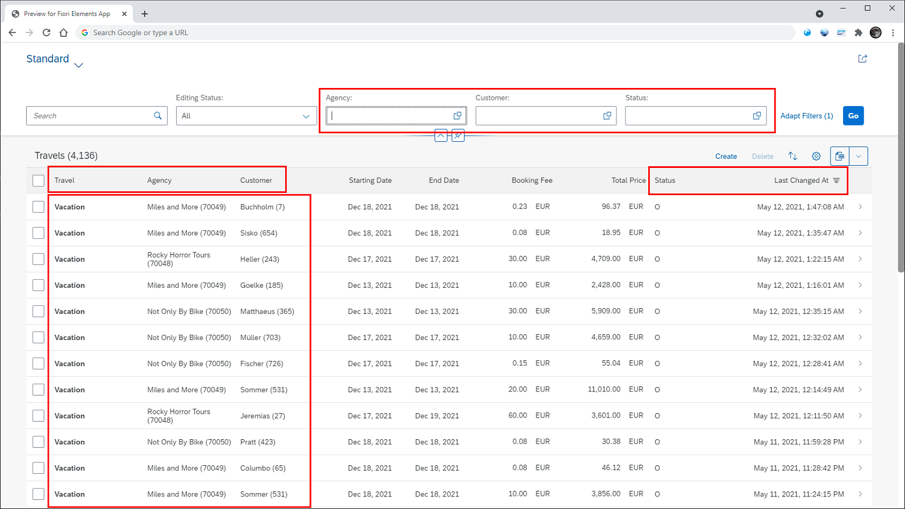


## Step 6. Implement value help for selection fields Customer and Status
When you click the value help icon of the selection field **Customer** in the filter bar, you get a dialog which provides the option to conditionally load data by the customer id. For better usability you would rather select customer data like name or address from a list.

1. To implement the value help, assign the annotation `@Consumption.valueHelpDefinition` to the field `CustomerID` within the projection view `ZC_FE_TRAVEL_######`.

    ```CDS
    @EndUserText.label: 'Customer'
    @ObjectModel.text.element: ['LastName']
    @Consumption.valueHelpDefinition: [{ entity : {name: '/DMO/I_Customer', element: 'CustomerID'  } }]
    CustomerID,
    _Customer.LastName as LastName,
    ```
      The entity property `name` points to the data view and `element` contains the key for the selection.


2. After saving, activating and refreshing your application, the field **Customer** provides the improved value help that allows a user friendly selection of customer data within the **Search and Select** tab. You are still able to do a conditional selection by choosing the **Define Conditions** tab on the dialog. By entering search values such as the **Last Name** and pressing the **Go** button, the resulting list is shown in the table. Selecting specific lines in the table and pressing the **OK** button will load a selected list of Travel items into list report.

    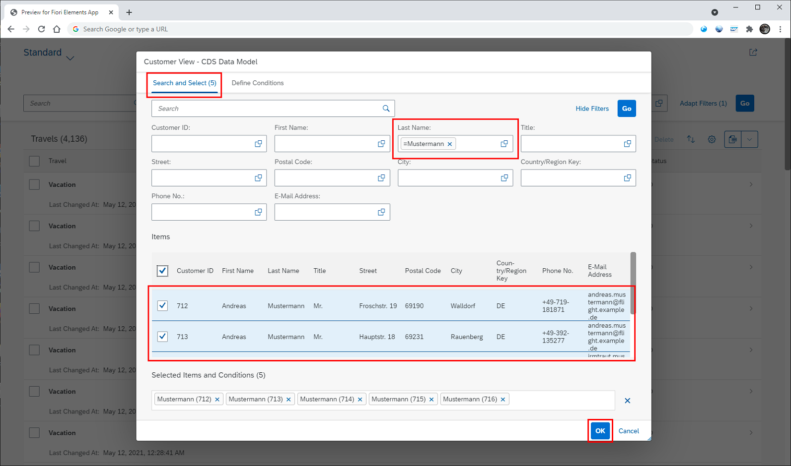

    Selection field **Status** also shows a conditional value help by default. From a user perspective it would be nice to get a list of values presented as a drop-down list since the number of different values is very limited.


3. In the projection view for the Travel entity `ZC_FE_TRAVEL_######` the annotation for the value help has to be defined for the `OverallStatus` field. As with the field `CustomerID` (see above), the annotation `@Consumption.valueHelpDefinition` is used with properties `name` and `element` containing the appropriate values.

    ```CDS
    ...
    @EndUserText.label: 'Status'
    @Consumption.valueHelpDefinition: [{ entity : {name: 'ZI_FE_STAT_######', element: 'TravelStatusId'  } }]
    OverallStatus,
    ...
    ```

    Save and activate the view.


4. Open the CDS view for the status description `ZI_FE_STAT_######`. Just above the view definition, insert an `@ObjectModel.resultSet.sizeCategory` annotation with value `#XS`. This results in a drop-down list.

    ```CDS
    ...
    @EndUserText.label: 'Travel Status view entity'
    @ObjectModel.resultSet.sizeCategory: #XS -- drop down menu for value help
    define view ZI_FE_STAT_######
    ...
    ```

    Save and activate the view.


5. After refreshing the application the **Status** field is now a drop-down list. Select one or more of the available status codes and press the **Go** button to load the filtered list.

    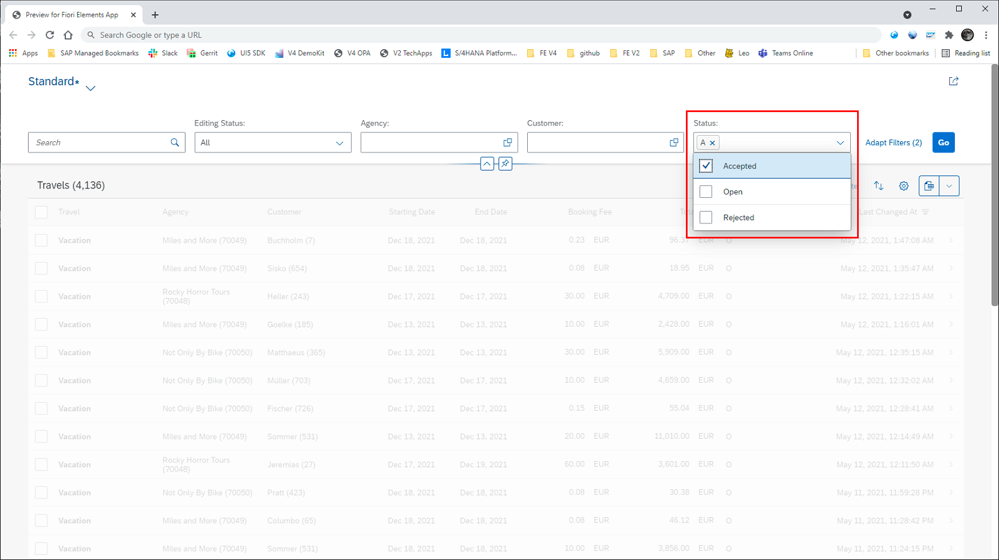

## Step 7. Description instead of Codes for the status field 
The column **Status** currently shows the internal codes stored within `OverallStatus`, but instead the description for these codes shall be displayed.

Although the related association is set correctly for `ZI_FE_TRAVEL_######` and descriptions are available through `ZI_FE_STAT_######`, the corresponding text annotation for the projection view is missing.

1. You can check the association already available within the CDS view for the travel entity `ZI_FE_TRAVEL_######` in folder **Data Definitions** and the publication of this association to make it available for projection views (lines 6 & 14 in the code snippet below).

    ```CDS
    define root view entity ZI_FE_TRAVEL_######
      as select from ZFE_ATRAV_######
      association [0..1] to /DMO/I_Agency as _Agency on $projection.AgencyID = _Agency.AgencyID
      association [0..1] to I_Currency as _Currency on $projection.CurrencyCode = _Currency.Currency
      association [0..1] to /DMO/I_Customer as _Customer on $projection.CustomerID = _Customer.CustomerID
      association [0..1] to ZI_FE_STAT_###### as _TravelStatus on $projection.OverallStatus = _TravelStatus.TravelStatusId
      composition [0..*] of ZI_FE_Booking_###### as _Booking
      {
        key TRAVEL_UUID as TravelUUID,
        ...

        ...
        _Customer,
        _TravelStatus
      }
    ```


2. Now the access to the status description has to be set within the projection view  `ZC_FE_TRAVEL_######`. Add the text annotation `@ObjectModel.text.element` for field `OverallStatus` as shown below (line 2). To load the description the corresponding field from the status description view has to be accessed by the association `_TravelStatus` (line 5).

    ```CDS
    @EndUserText.label: 'Status'
    @ObjectModel.text.element: ['TravelStatusText']
    @Consumption.valueHelpDefinition: [{ entity : {name: 'ZI_FE_STAT_######', element: 'TravelStatusId'  } }]
    OverallStatus,
    _TravelStatus.TravelStatusText as TravelStatusText,
    ```
    Save and activate the view.


3. With these settings the description is displayed in the column **Status** but additionally, the code is shown within parentheses. You can use the `@UI.textArrangement` annotation with value `#TEXT_ONLY` to omit the key. Open the metadata extension file  `ZC_FE_TRAVEL_######` and add the text arrangement annotation to the field `OverallStatus` (line 3).

    ```CDS
    @UI.lineItem: [{ position: 80 }]
    @UI.selectionField: [{ position: 30 }]
    @UI.textArrangement: #TEXT_ONLY
    OverallStatus;
    ```
    Save and activate the metadata extension.


4. After refreshing your application you will see the status description within the **Status** column.

    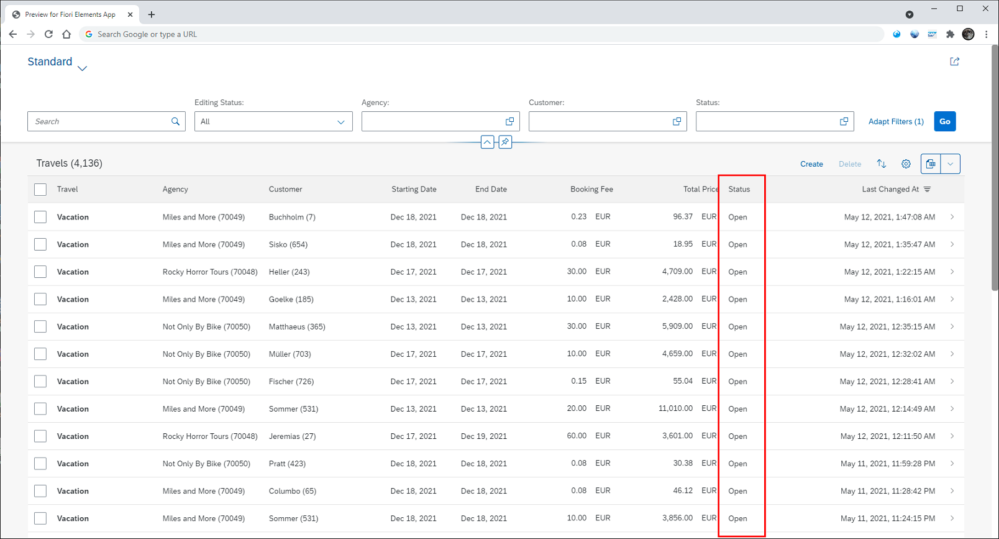

## Step 8. Implement a conditional status emphasis

>This step requires implementing some additional backend logic. You can complete the remaining exercises in this course also if you skip this step. In this case you will not get the semantic coloring for the status field. Neither in the list report (travel list) nor in the object page (travel details).

The values of the **Status** field can be semantically colored to visually differentiate the meaning. This can be achieved by using the criticality property for the lineItem annotation. 

1. The criticality feature requires specific values for the different colors to be shown on the UI. Therefore a new field `OverallStatusCriticality` will be defined in the CDS view  `ZI_FE_TRAVEL_######`. This field will be filled with color codes derived from the values of the field `overall_status`. See below coding fragment which shows a case-structure to define the content of the new field `OverallStatusCriticality` within lines 5 to 10.

    ```CDS
    ...
    description as Description,

    overall_status as OverallStatus,
    case overall_status
      when 'O'  then 2    -- 'open'       | 2: yellow colour
      when 'A'  then 3    -- 'accepted'   | 3: green colour
      when 'X'  then 1    -- 'rejected'   | 1: red colour
                else 0    -- 'nothing'    | 0: unknown
    end                   as OverallStatusCriticality,

    @Semantics.user.createdBy: true
    created_by as CreatedBy,
    ...
    ```
    Take over the case-structure into the CDS view  `ZI_FE_TRAVEL_######` just below the field `overall_status`. Save and activate the view.


2. Adding a new field to the CDS view is a structural change which requires a recreation of the corresponding draft table `ZFE_DTRAV_######`. This draft table contains all the fields of the CDS view.

    This can easily be done by applying a quick fix within the behavior definition file `ZI_FE_TRAVEL_######` in folder **Core Data Services** > **Behavior Definitions**. Open this file in your editor and you will immediately see the error shown in the line where the draft table for the Travel entity is referenced.

    Click on the light bulb icon on the left in that line or position your cursor on the draft table file name `ZFE_DTRAV_######` and press **`CTRL + 1`**. The system proposes to recreate the draft table. By double-clicking on the proposal, the recreation of the table will be started.

    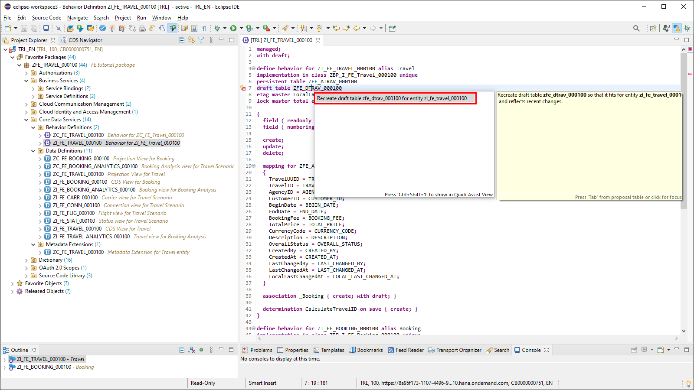

    As soon as the recreation is finished, you will see the draft table `ZFE_DTRAV_######` loaded into the editor containing the new field `OverallStatusCriticality`.

    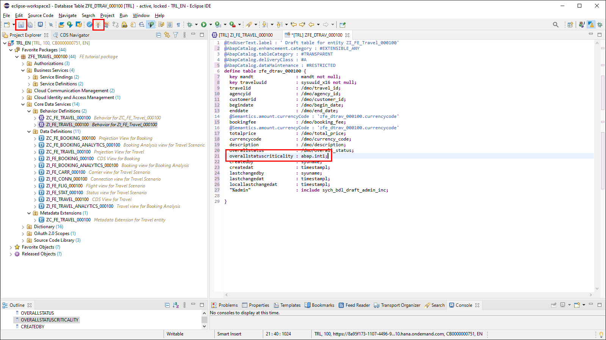

    Save and activate the draft table and then activate also the behavior definition file `ZI_FE_TRAVEL_######` which is still open in your editor. The error disappears as soon as the behavior definition is activated.


3. To be able to use the new field within UI annotations you need to take it over to the projection view of the travel entity `ZC_FE_TRAVEL_######`. Insert the field `OverallStatusCriticality` just below the definition for the field `OverallStatus` (see line 7 in the coding fragment).

    ```CDS
    ...
    @ObjectModel.text.element: ['TravelStatusText']
    @Consumption.valueHelpDefinition: [{ entity : {name: 'ZI_FE_STAT_######', element: 'TravelStatusId'  } }]
    OverallStatus,
    _TravelStatus.TravelStatusText as TravelStatusText,

    OverallStatusCriticality,

    CreatedBy,
    ...
    ```

    Save and activate the projection view.


4. As a last step you need to add the criticality to the metadata extension for the Travel entity `ZC_FE_TRAVEL_######`.

    This can be done by adding the property `criticality` with value  `OverallStatusCriticality` to the `@UI.lineItem` annotation of field `OverallStatus`  (see line 5 in the coding fragment).

    ```CDS
    ...
    @UI.lineItem: [{ position: 70 }]
    TotalPrice;

    @UI.lineItem: [{ position: 80, criticality: 'OverallStatusCriticality' }]
    @UI.selectionField: [{ position: 30 }]
    @UI.textArrangement: #TEXT_ONLY
    OverallStatus;

    @UI.lineItem: [{ position: 90 }]
    LocalLastChangedAt;
    ...
    ```

    Save and activate the metadata extension file.

    Refresh your application and reload the data by pressing **Go** in the list report. Now the content of column **Status** is shown in different colors depending on the values of the field.

    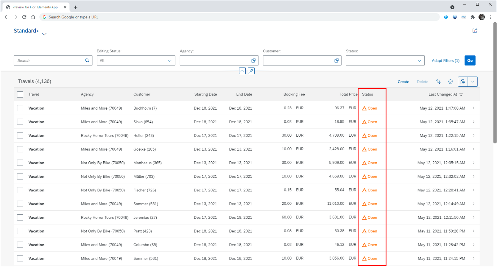


## Summary
You have completed the exercise!
In this unit, you have learned how to create a list report using ABAP CDS annotation.

## Next Exercise
[Week 2 Unit 1: Creating an object page](../week2/unit1.md)

