# Hands-on exercise for week 2 unit 4: Generating the list report – object page app

## Previous exercise
[Hands-On exercise for week 2 unit 3: Preparing your front-end development environment](unit3.md)

## Video on openSAP.com platform
[Generating the list report – object page app](https://open.sap.com/courses/fiori-ea1/items/GnkhFA7CKcRoH2pRJnUtm)

## Introduction
In this unit, you will learn how to use the Fiori generator to create an application with a list report object page floor plan leveraging the ABAP CDS annotations we maintained in previous units.  The generator will ask a number of questions in a sequence of steps in order to determine the type of application that needs to be built.

**Prerequisite: You have performed all previous exercises of this course.**

## Step 1. Ensure you are logged in to Cloud Foundry

The first step is to ensure you are logged into Cloud Foundry so that you can use the service you have created in previous units.

1. Click **Terminal** and choose **New Terminal**

A new terminal window will open inside of Business Application Studio.  

2. If your BTP Trial account is assigned to region 🇪🇺Europe type `cf login -a https://api.cf.eu10.hana.ondemand.com`, if it is assigned to the 🇺🇸US region type `cf login -a https://api.cf.us10.hana.ondemand.com` and provide your username and password to login to Cloud Foundry. If you are not sure to which region the BTP Trial account is assigned check the [BTP Cockpit](https://account.hanatrial.ondemand.com/trial/#).

## Step 2. Launch the Fiori generator

The next step is to launch the SAP Fiori tools application generator.  

1. Click **View** and choose **Find Command\.\..**

    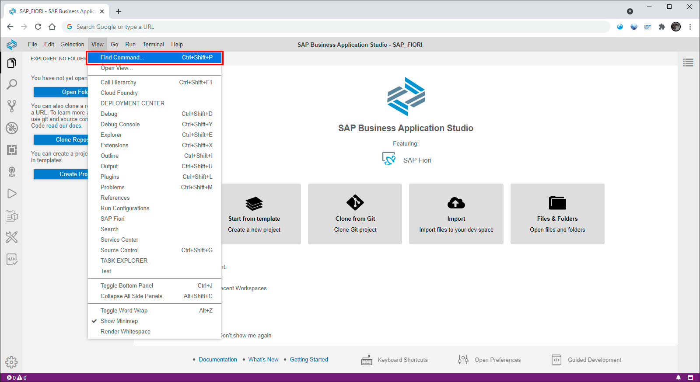

2. Type **Fiori** to narrow the search and click **Fiori: Open Application Generator.** 

    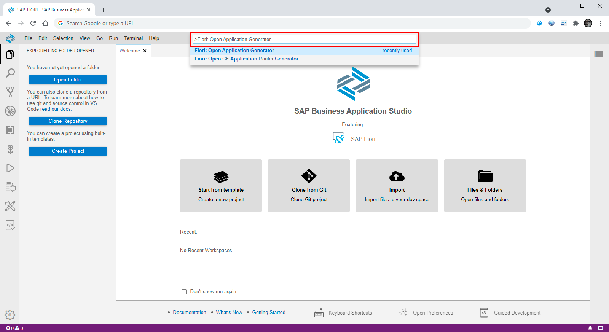
  

3. The Fiori generator will launch.  You will be presented with the first step and need to choose a floor plan the reflects the application you would like to generate.  In this case, choose the tile **List Report Object Page**  and click **Next**. 

    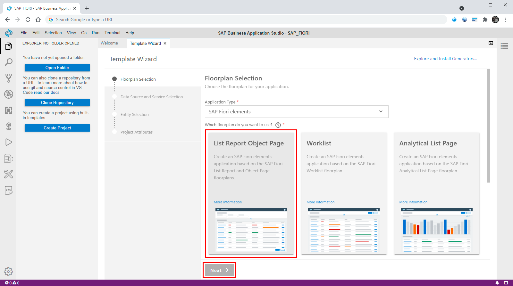
  

4. Next you will be asked to provide a data source to be used with the chosen floorplan.  We will choose the travel OData V4 service that you created in week 1, unit 5 as part of the OData creation exercise.  Choose the following options:

    - **Connect to an SAP System** from the data source selection, then
    - **ABAP Environment on SAP Business Technology Platform**, 
    - **default-abap-trial** as the ABAP environment
    
    and finally the travel service with your number.  Click **Next**. 

   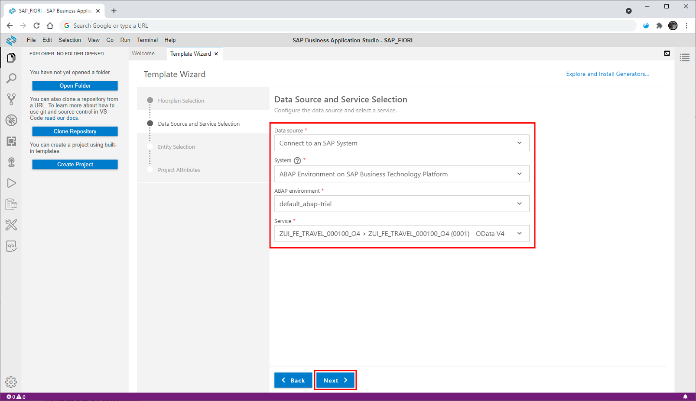
  

5. Now choose a main entity for the list report and an optional navigation entity.  The options available will be dependent on the entities that are contained in the OData service you selected in the previous step.  In this case, choose **Travel** as the main entity and leave the optional navigation entity as **None**, then click **Next**. 

    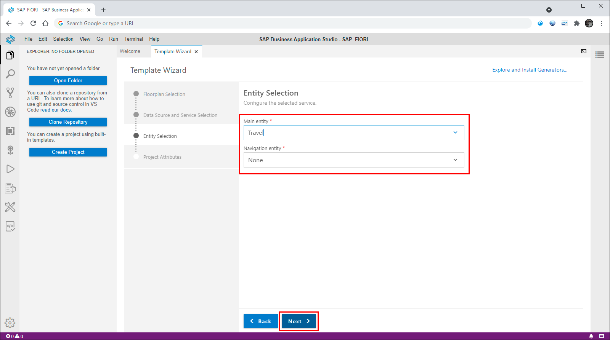

  
6. On the final step of the generator, you can choose to provide some configuration options for your project. In the advanced options section you can optionally chose the version of UI5 and the theme required.  Similar optional sections are available for deployment and Fiori launchpad configuration.  In this case, we will just fill out the displayed fields as follows:

   **Module name** : travellist

   **Application title** : Travel List

   **Application Namespace** : sap.fe.demo

   **Description** : SAP Fiori elements

    Click **Finish**.
  
    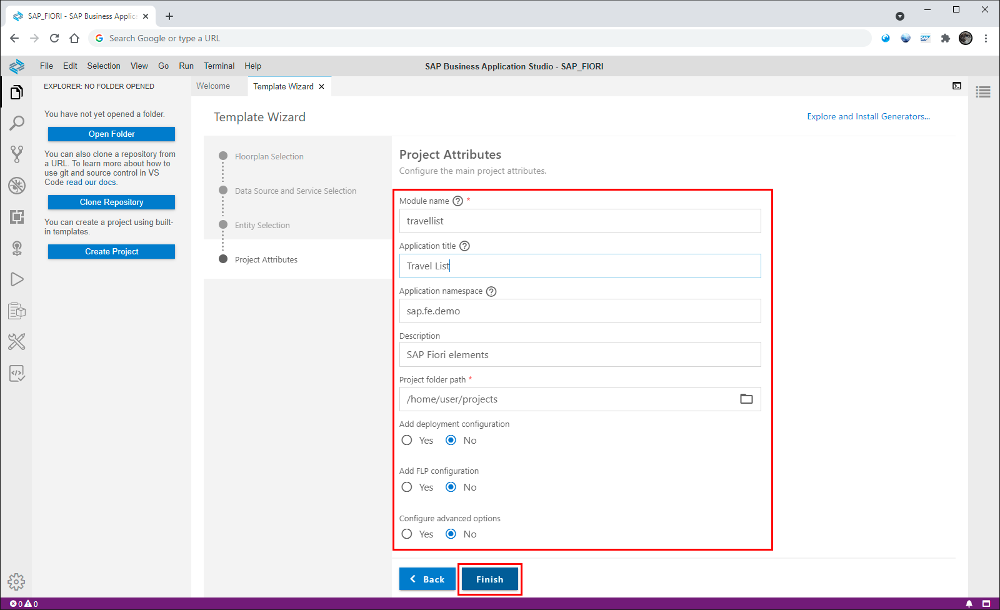

  
7. The Fiori generator window will close and a popup will display in the corner detailing that the application is being installed.  When it is completed, you will see a message telling you that the files have been generated.  The generated application will be a new directory named **travellist**, which reflects the module name chosen above.

    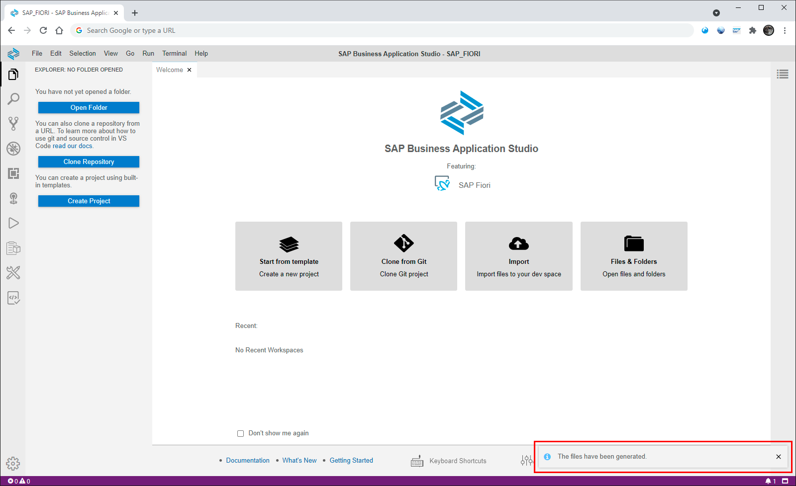

8. Once the application has been successfully generated, if you do not already have a workspace open, then click on **Open Folder** button in the left hand explorer window. Choose the **projects** and then **travelllist** folder for the newly created project and click **Open**. The workspace. will refresh with the folder location.

    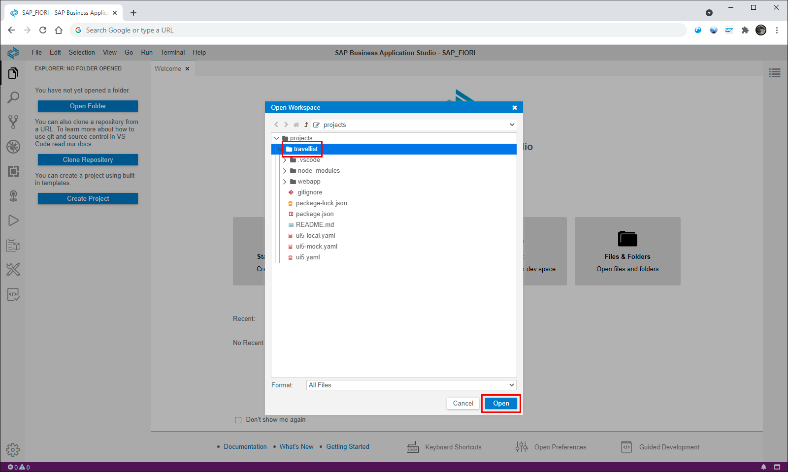

  
9. The generated files for the new Fiori application will be displayed in the project explorer panel.

    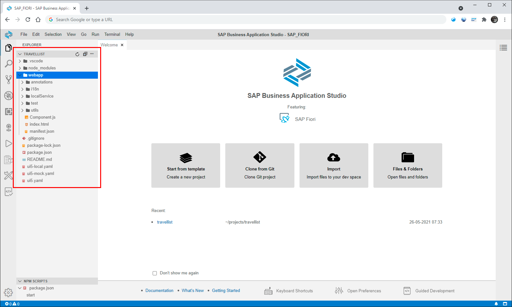

  
10. We will now try and start the newly generated Fiori application.  Click on the **Run Configurations** icon on the left hand side panel.

    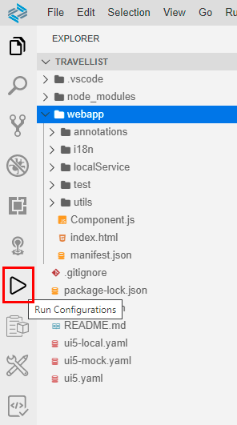

11. Run configurations will be already created for the newly generated Fiori application.  You can choose to start the application with one of the following options:

    **Start travellist** : The Fiori application will connect to the live OData service on start up.

    **Start travellist Local** : The Fiori application will download the UI5 libraries locally into the project and use mock data to represent the OData service on start up.
    This is to accommodate situations where the live OData service may be down or unreachable.
   
    We will start the application and use live data, so select the play icon alongside **Start travellist** to start up the application

     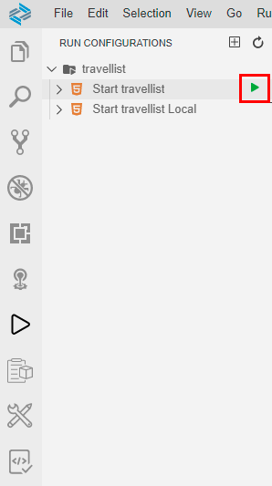

  
12. The Fiori application will attempt to launch in a new browser window.  If you have a popup blocker enabled, a warning message will be displayed.  Click on the **Open** button to proceed.

    

  
13. The application will load and you should see the list report with the travel details from the associated OData service.

    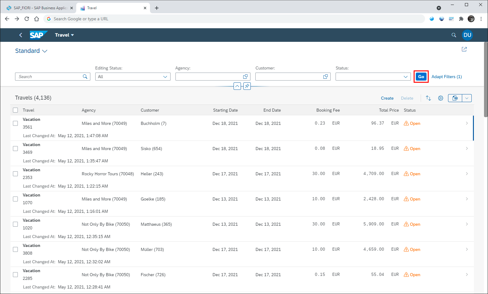

  
## Summary
You have completed the exercise!
In this unit, you have learned how to generate an SAP Fiori application using the generator.  You can use the generator to create different variations of your Fiori application:

- Multiple floor plans that represent both Fiori elements and Fiori freestyle applications.
- Different data source options
- Entity customisation options based on the data source provided.
- Options to choose the UI5 version and theme.

## Next Exercise
[Week 2 Unit 5: Configuring the app](unit5.md)
