# Hands-on exercise for week 2 unit 6:<br/>Adding custom controls and logic


## Previous exercise
[Hands-On exercise for week 2 unit 5: Configuring the app](unit5.md)

## Video on openSAP.com platform
[Adding custom controls and logic](https://open.sap.com/courses/fiori-ea1/items/2563cqMfba0zSDqESppAdO)

## Introduction

In this exercise you will learn how to add a custom section to your object page by using the SAP Fiori Page Map.

**Prerequisite: You have performed all previous exercises of this course.**

## Step 1: Add fragment with custom code to your project

First you need to add the fragment with custom code provided as an example to your project.

1. Click on the folder **webapp** in the project structure tree with the right mouse button.

   


2. Click on **New Folder**.

   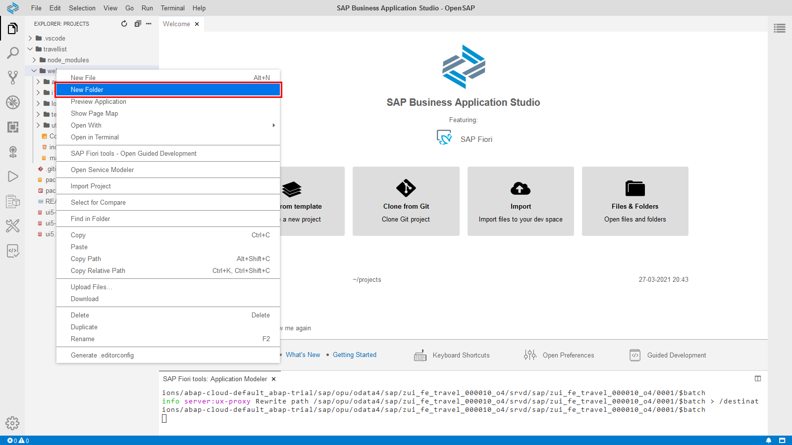


3. Enter **ext** in the input field and click on **OK**.

   


4. Click on the folder **ext** in the project structure tree with the right mouse button.

   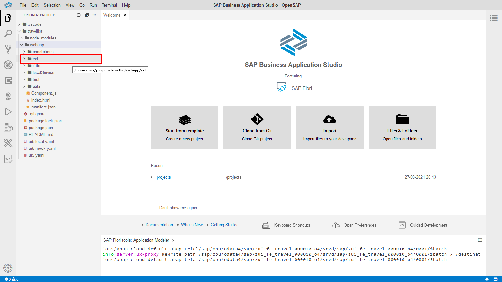


5. Click on **New File**.

   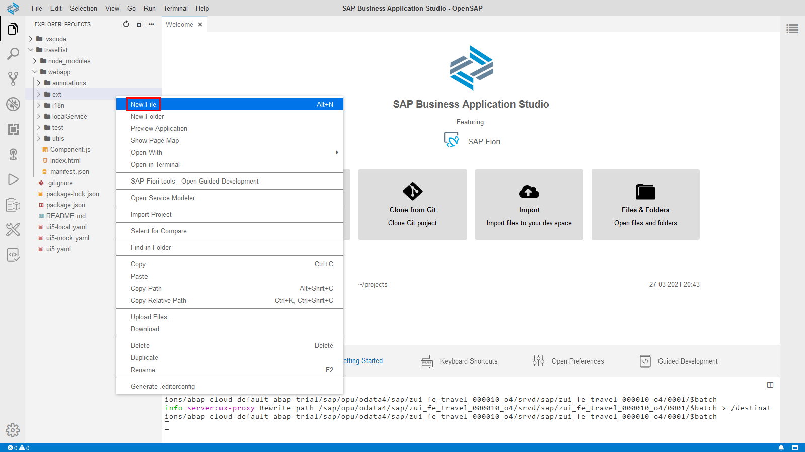


6. Enter **GeoMap.fragment.xml** in the input field and click on **OK**.

   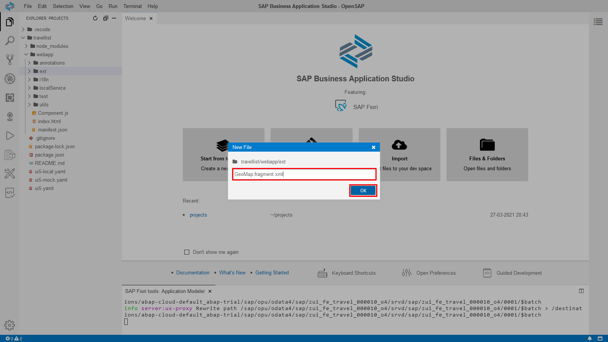


7. Copy the following XML snippet and paste it into your newly created GeoMap.fragment.xml file. Please note: For the sake of simplicity this example creates a GeoMap with hard-coded values. In a real application the geo map data would be exposed by the backend service and bound against the control.
   ```xml
   <core:FragmentDefinition xmlns:core="sap.ui.core"
       xmlns="sap.m"
       xmlns:macros="sap.fe.macros"
       xmlns:vbm="sap.ui.vbm"
       displayBlock="true">

       <VBox>

       <!-- HBox class="">
           <Text text="The bookings were confirmed on" class="sapUiTinyMarginEnd"/>
           <macros:Field readOnly="true" metaPath="CreatedAt" id="custom-flightdate"/>
           <Text text="by" class="sapUiTinyMarginBeginEnd"/>
           <macros:Field readOnly="true" metaPath="AgencyID" id="custom-airline"/>  
       </HBox  -->

       <vbm:AnalyticMap width="100%" xmlns:l="sap.ui.layout" height="600px" initialPosition="-47.48339103742949; 48.70365903454684;0" initialZoom="2" class="sapUiMediumMarginTop">
           <vbm:vos>
               <vbm:Routes>
                   <vbm:Route position="8.682127;50.110924;0; -73.780968;40.641766;0" color="rgb(204,0,0)" colorBorder="rgb(255,255,255)" linewidth="3" routetype="Geodesic" />
                   <vbm:Route position="-73.780968;40.641766;0; -122.389977;37.615223;0" color="rgb(255,128,0)" colorBorder="rgb(255,255,255)" linewidth="3" routetype="Geodesic" />
                   <vbm:Route position="-122.389977;37.615223;0; 8.682127;50.110924;0" color="rgb(0,153,76)" colorBorder="rgb(255,255,255)" linewidth="3" routetype="Geodesic" />
               </vbm:Routes>
               <vbm:Spots>
                   <vbm:Spot position="8.682127;50.110924;0" tooltip="Frankfurt am Main (FRA)" labelType="Default" labelText="Frankfurt am Main (FRA)" labelPos="5" />
                   <vbm:Spot position="-73.780968;40.641766;0" tooltip="New York (JFK)" labelType="Default" labelText="New York (JFK)" labelPos="5" />
                   <vbm:Spot position="-122.389977;37.615223;0" tooltip="San Francisco (SFO)" labelType="Default" labelText="San Francisco (SFO)" labelPos="5" />
               </vbm:Spots>
           </vbm:vos>
       </vbm:AnalyticMap>
       </VBox>
   </core:FragmentDefinition>
   ```

## Step 2: Add custom section to your object page

Now you will add a custom section to your object by using the fragment you just added to your project.

1. First of all open the Page Map. Click on your **travellist** project folder with the right mouse button.

   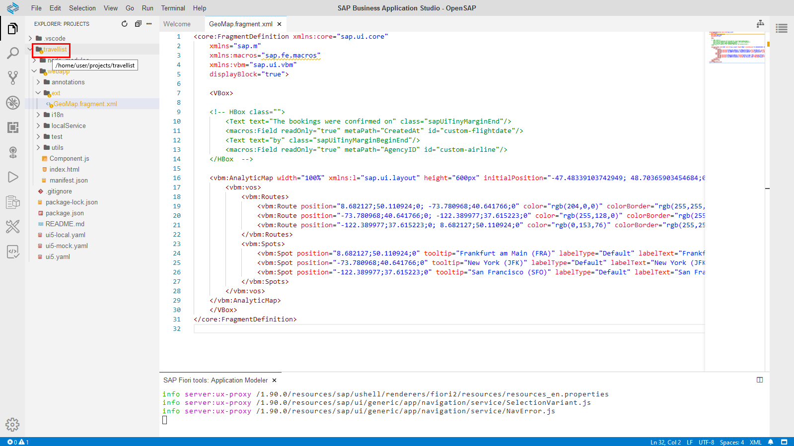


2. Click on **Show Page Map**.

   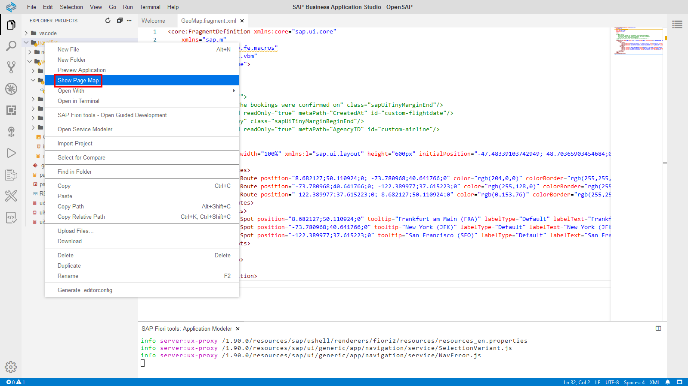

   You see your current application structure with the list report and the object page. Let's change the object page layout.


3. Click on the **Edit** button in your object page tile.

   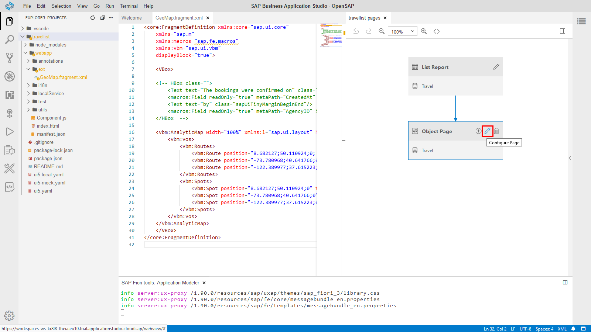

   You see the current settings of the object page and the available section. Let's add a new section.


4. Click on the **Add** button next to **Sections**. 

   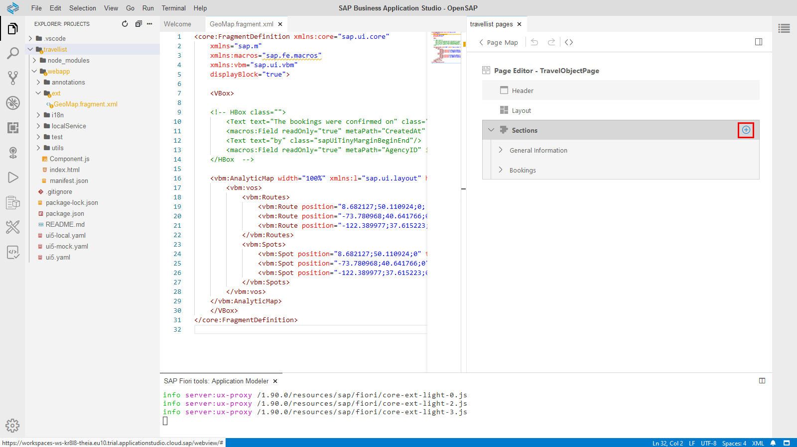


5. Enter **itinerary**  into the **Id** field.
   
   Enter  **Itinerary**  in the **Title** field.

   Chose **Use Existing Fragment**.

   Select **Bookings (Booking)** as **Target Facet/Section**.

   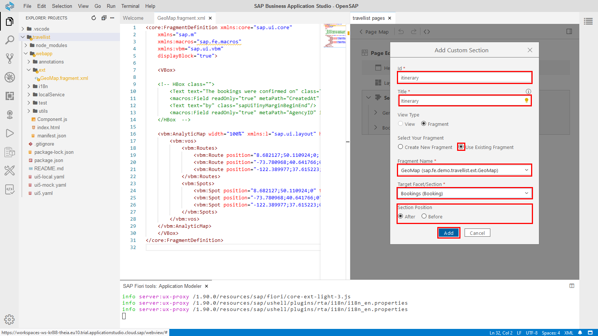


6. Click on **Add** to add the custom section.

   Please note: In this exercise you added the XML to your project and made use of it once you created a new section. As alternative you can also ask the Fiori Page Map to create a new XML fragment for you.

## Step 3: Test your application

1. Start the preview  as described in [Hands-On exercise for week 1 unit 6: Creating a list report](../week1/unit6.md). 


2. Navigate to any booking instance. You'll see a new section **Itinerary**. You can click on it or scroll down to see a nice geo map implementation.

   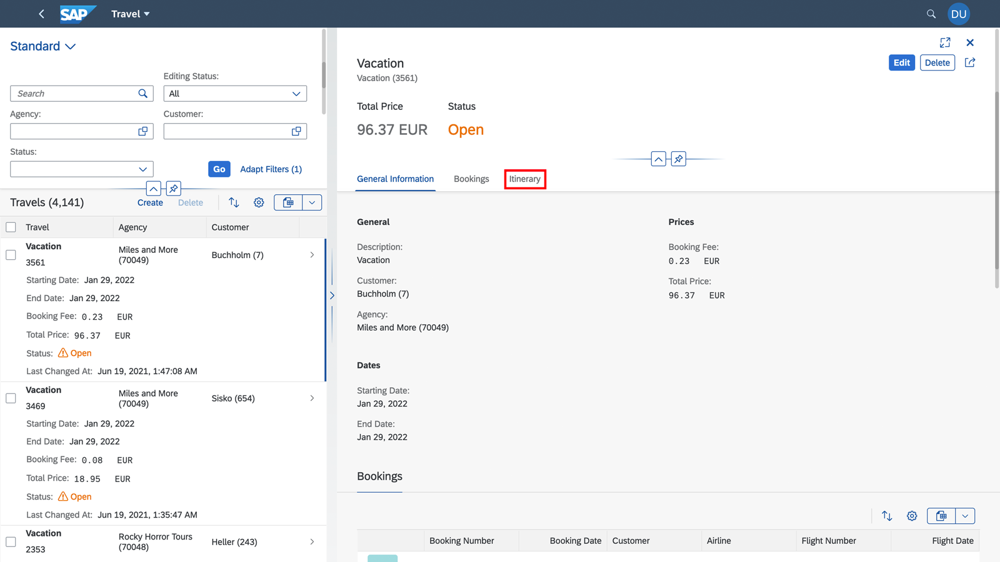


## Step 4: Make use of building blocks provided by SAP Fiori elements

Now we make use of the field building block provided by SAP Fiori elements.
By using Fiori elements building blocks you can save implementation effort in your custom code while keeping a consistent look and feel within your page.

1. Turn back to the fragment you created in your project.

   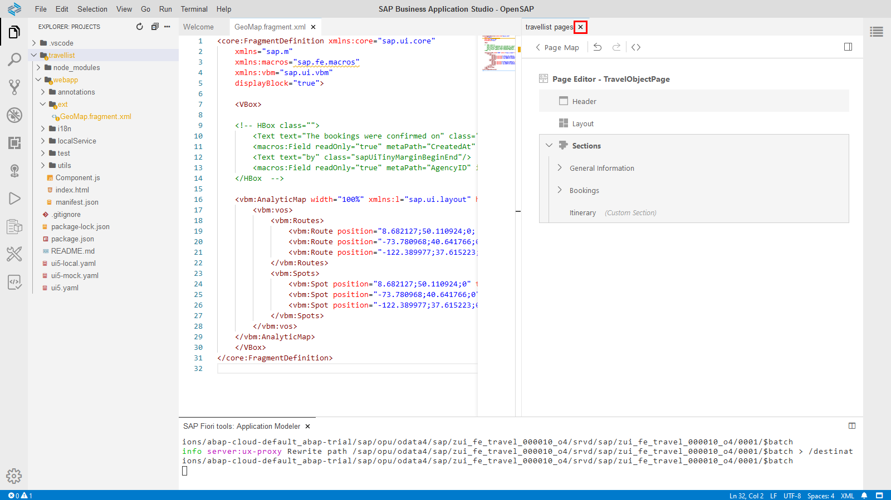


2. Activate the commented code by removing **!--** in line 7 and *--* in line 14.

   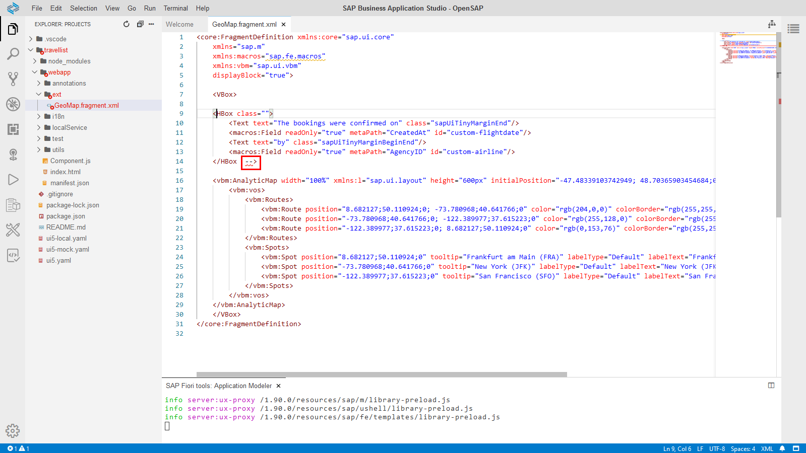
   
   The result should look like this:
   
    ```xml
   <core:FragmentDefinition xmlns:core="sap.ui.core"
       xmlns="sap.m"
       xmlns:macros="sap.fe.macros"
       xmlns:vbm="sap.ui.vbm"
       displayBlock="true">

       <VBox>

       <HBox class="">
           <Text text="The bookings were confirmed on" class="sapUiTinyMarginEnd"/>
           <macros:Field readOnly="true" metaPath="CreatedAt" id="custom-flightdate"/>
           <Text text="by" class="sapUiTinyMarginBeginEnd"/>
           <macros:Field readOnly="true" metaPath="AgencyID" id="custom-airline"/>  
       </HBox>

       <vbm:AnalyticMap width="100%" xmlns:l="sap.ui.layout" height="600px" initialPosition="-47.48339103742949; 48.70365903454684;0" initialZoom="2" class="sapUiMediumMarginTop">
           <vbm:vos>
               <vbm:Routes>
                   <vbm:Route position="8.682127;50.110924;0; -73.780968;40.641766;0" color="rgb(204,0,0)" colorBorder="rgb(255,255,255)" linewidth="3" routetype="Geodesic" />
                   <vbm:Route position="-73.780968;40.641766;0; -122.389977;37.615223;0" color="rgb(255,128,0)" colorBorder="rgb(255,255,255)" linewidth="3" routetype="Geodesic" />
                   <vbm:Route position="-122.389977;37.615223;0; 8.682127;50.110924;0" color="rgb(0,153,76)" colorBorder="rgb(255,255,255)" linewidth="3" routetype="Geodesic" />
               </vbm:Routes>
               <vbm:Spots>
                   <vbm:Spot position="8.682127;50.110924;0" tooltip="Frankfurt am Main (FRA)" labelType="Default" labelText="Frankfurt am Main (FRA)" labelPos="5" />
                   <vbm:Spot position="-73.780968;40.641766;0" tooltip="New York (JFK)" labelType="Default" labelText="New York (JFK)" labelPos="5" />
                   <vbm:Spot position="-122.389977;37.615223;0" tooltip="San Francisco (SFO)" labelType="Default" labelText="San Francisco (SFO)" labelPos="5" />
               </vbm:Spots>
           </vbm:vos>
       </vbm:AnalyticMap>
       </VBox>
   </core:FragmentDefinition>
   ```

   
3. Go back to your application preview. You will see on top of the geo map some additional itinerary information. As you can see although in your XML you are referring only to AgencyID the name of the agency ID is shown as well. This is the case because the AgencyID has a text annotation pointing to the agency name.
    
   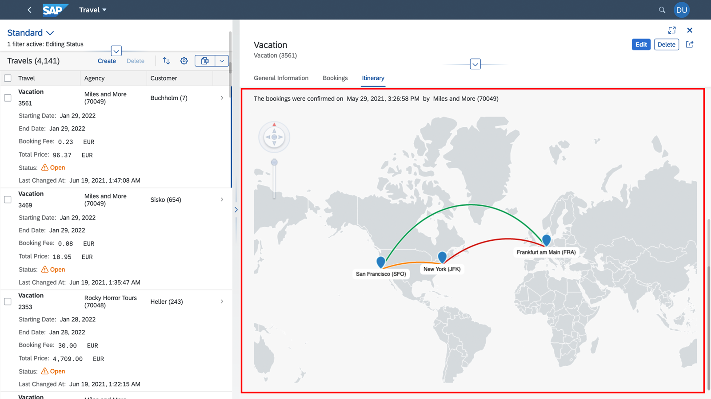

## Summary
You have completed the exercise!
In this unit, you have learned 
- how to add a custom section to your object page by using the Fiori Page Map
- how to make use of building blocks provided by SAP Fiori elements

## Next Exercise
[Week 3 Unit 1: Creating an analytical list page](../week3/unit1.md)
